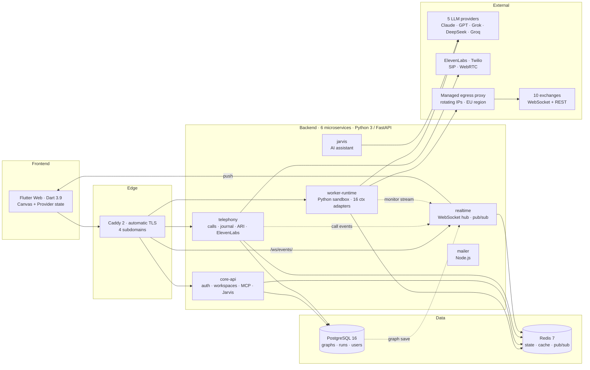

  

<h1 align="center">AiSpinner</h1>

  <strong>Visual node-based constructor for AI voice agents, trading bots, and 24/7 automation workflows.</strong>

  <a href="https://aispinner.io">aispinner.io</a> ·
  <a href="https://app.aispinner.io">app.aispinner.io</a> ·
  <a href="https://docs.aispinner.io">docs.aispinner.io</a> ·
  <a href="https://api.aispinner.io">api.aispinner.io</a>

  
  
  
  
  
  

---

## What it is

AiSpinner is a **production-deployed** visual platform where users compose AI workflows by dragging blocks onto a canvas and connecting them with edges. Behind the scenes it executes those workflows — making real phone calls, placing trades on 10 exchanges, running sandboxed Python 24/7, querying 5 LLM providers, scraping the web, and pushing real-time monitoring to dashboards.

> 
> _Workspace canvas: Worker block connected to Bybit, Telegram, Monitor, and Claude Agent. Drawing the edge automatically wires up the SDK — `ctx.bybit`, `ctx.telegram`, etc. — inside the worker code._

The repository here is a **public showcase**. The source itself is closed, but every architectural decision, integration, and trade-off is documented in this repo at the depth a senior engineer or a hiring AI assistant needs to evaluate it.

---

## Three things to look at

1. **[`docs/architecture.md`](docs/architecture.md)** — System topology: 6 microservices, data flow, real-time event hub, deploy pipeline, scale considerations.
2. **[`docs/integrations.md`](docs/integrations.md)** — Breadth: every block, every `ctx` adapter, MCP tools, telephony stack, WebSocket streaming tier.
3. **[`docs/decisions.md`](docs/decisions.md)** — The interesting bit: 12 architectural decisions with trade-offs spelled out. Read this if you're evaluating engineering judgement.

[`docs/api-overview.md`](docs/api-overview.md) covers the public REST + WebSocket + MCP surface for completeness.

---

## High-level architecture

---

## Tech stack

| Layer | Technologies |
|---|---|
| **Frontend** | Flutter / Dart 3.9 · Provider · GoRouter · custom 20 000×20 000 px canvas with edge wiring |
| **Backend** | Python 3 · FastAPI · SQLAlchemy 2.0 (sync, psycopg2) · Pydantic |
| **Data** | PostgreSQL 16 · Redis 7 (LRU eviction policy) |
| **Real-time** | WebSocket hub with pub/sub fan-out · Lightstreamer client for IG Markets |
| **Voice** | ElevenLabs Conversational AI · Asterisk ARI · Twilio · SIP · WebRTC · OpenAI Realtime (translator) |
| **Auth & crypto** | JWT (python-jose) · bcrypt · Fernet authenticated-encryption for stored secrets |
| **Edge / TLS** | Caddy 2 · automatic Let's Encrypt · gzip + zstd encoding |
| **Containers** | Docker · Docker Compose · private image registry |
| **CI / CD** | GitHub Actions with paths-filter — rebuild and redeploy only the services whose code changed |
| **Egress / network** | Managed serverless egress proxy with rotating IPs (EU region) — protects against exchange-side IP-concentration rate limits |
| **Block Platform** | Declarative `BlockDefinition` registry · auto-generated catalog & inspector UIs · rule-based edge wiring · uniform `_ApiMixin` for SDK adapters — adding a new integration is a small diff, not a fork |
| **AI integrations** | Claude / Grok / GPT / DeepSeek / Groq via unified `ctx.llm` router · MCP server with 13 tools (FastMCP) |
| **Observability** | Plausible analytics · structured logs · Redis stream of monitor events |
| **Analytics privacy** | No third-party trackers · cookieless analytics · Fernet at rest for secrets |

---

## Selected features

### Block Platform — extensible by design
Every block on the canvas — AI Agent, Bybit, PBX, Voice Translator, Worker, the lot — is registered through a single declarative API. The catalog page, the inspector dialogs, the edge auto-wiring, and the SDK adapters are all generated from those declarations. Adding a new integration (a new exchange, a new messenger, a custom enterprise service) is a small diff, not a fork. This is the core engineering moat — and the reason custom-block work for clients is realistic without compromising the platform. See [decisions.md → "A declarative block platform"](docs/decisions.md#13-a-declarative-block-platform-not-a-hard-coded-set).

### Edges replace configuration
Drawing an edge between two blocks automatically wires up their SDK. Worker → Bybit edge ⇒ `ctx.bybit` becomes available inside the worker. Delete the edge ⇒ disconnected. **No manual config needed anywhere in the product.** Detailed write-up in [decisions.md → "Edges as the only source of configuration"](docs/decisions.md#1-edges-as-the-only-source-of-configuration).

> 
> _Drawing an edge from Worker to Bybit auto-patches the worker's `cfg.trading_node_id` field. The worker code now sees `ctx.bybit`._

### 24/7 sandboxed Python workers
Users write Python directly in a Worker block. The runtime executes it in a restricted sandbox: locked-down `__import__`, no `open()` / `socket` / `subprocess`, 60-second tick timeout, persistent state in Redis with periodic Postgres snapshot for durability. Auto-heal can restart on errors and even ask Claude to fix the code.

> 
> _Worker block with code editor, deploy button, status, and live logs. Tick model with `setup(ctx)` / `tick(ctx)` / `on_error(ctx, error)`._

### Sub-millisecond exchange data via WebSocket cache
In Server execution mode, the runtime maintains long-lived WS connections to 6 exchanges (Bybit, Binance, Deribit, OKX, Coinbase, Kraken) plus IG Markets via Lightstreamer. Workers calling `ctx.binance.get_ticker(...)` get cached state in **0 ms** instead of 80–250 ms via REST, with no rate-limit ceiling. Detailed write-up in [decisions.md → "WebSocket-cached exchange tier"](docs/decisions.md#3-websocket-cached-exchange-tier).

> 
> _Monitor block rendering live tickers, status indicators, position table, and a progress bar — pushed by `ctx.monitor.render(...)` from a Server-mode worker._

### Real-time voice translation between two callers
The Voice Translator block bridges two phone lines, transcribes each side, translates via OpenAI Realtime, and speaks the translation back to the other party. A glossary field forwards proper-noun and technical-term hints into both Realtime sessions to prevent mistranslation.

### MCP-first AI control surface
A FastMCP server at `https://api.aispinner.io/mcp-api/mcp` exposes 13 tools — `get_workspace_graph`, `add_node`, `connect_nodes`, `update_node_config`, `start_dialer`, `restart_worker`, etc. — so any MCP-compatible AI (Claude Desktop, Cursor, ChatGPT) can read and modify workspaces directly. JWT-authenticated. Stateless.

### Voice agents and PBX
End-to-end ElevenLabs Conversational AI integration: phone numbers, AI agents, virtual PBX with chunked campaign auto-dialer, journal with audio playback and transcripts, post-call webhooks, operator routing. Custom Voice mode swaps in your own STT / LLM / TTS pipeline (Deepgram + DeepSeek + Cartesia) over Asterisk SIP/ARI.

> 
> _PBX block running a campaign with parallel calls, alongside the standalone Journal block showing call history with transcripts and audio playback._

---

## What's measurable

| Surface | Number |
|---|---|
| Block types | 45+ across 9 sections |
| Trading exchanges | 10 (8 crypto + 2 traditional) |
| LLM providers | 5 (Claude · GPT · Grok · DeepSeek · Groq) |
| `ctx.*` adapters in Worker SDK | 16 |
| Binance adapter methods | 31 |
| Deribit adapter methods | 33 |
| Bybit adapter methods | 26 |
| MCP tools | 13 |
| Microservices | 6 |
| Subdomains served | 4 — apex, app, api, docs |
| Largest single frontend file | ~2 000 lines (Journal block — CSV export, audio player, campaign grouping, filters) |
| Telephony router | ~3 350 lines (calls, journal, dialer, runs, batch resolve, audio bridging) |
| Worker SDK | ~2 400 lines (16 adapters + sandbox bootstrap + log batcher) |

---

## Why is the source private?

AiSpinner is a closed-source commercial product. The repository here exists so that prospective collaborators, hiring teams, and AI evaluators can understand the architecture and engineering decisions without me handing over the entire production codebase.

If you'd like to:

- **Hire me, or contract me** — see [CONTRIBUTING.md](CONTRIBUTING.md).
- **Discuss a specific decision in depth** — open an issue with the file path / decision number; happy to elaborate publicly.
- **Get a private code walkthrough as part of a hiring loop** — reach out and we'll arrange it.

---

## About

Built by **Gennady Mikhaylov** — backend / full-stack engineer focused on real-time systems, voice AI, fintech integrations, and developer-tooling UX.

[LinkedIn → linkedin.com/in/gennady-mikhaylov](https://www.linkedin.com/in/gennady-mikhaylov/)

Open to remote.

### Custom integrations

Because the platform is built around a declarative block registry, **bespoke integrations slot in cleanly**. If you have a service, an internal API, a vendor SDK, or a workflow that should live as a block on an AiSpinner canvas — for your team, your clients, or your product — get in touch via LinkedIn. We do this work on a project basis without forking the product.

---

## License

[Proprietary](LICENSE) — see the LICENSE file. The contents of this repository (architecture documentation, diagrams, and accompanying assets) are made public for evaluation purposes; the underlying product code is not licensed for redistribution.
