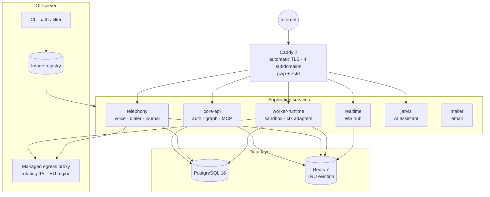
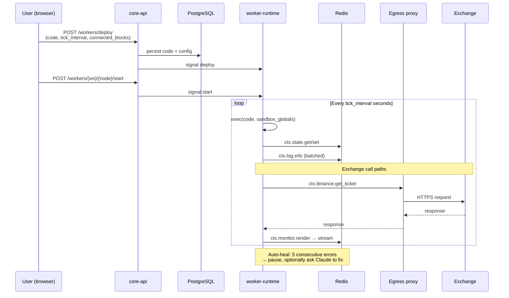
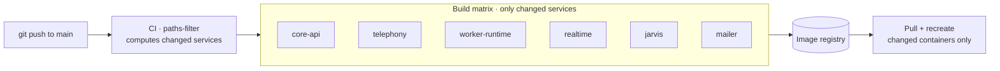

# Architecture

This document describes the production architecture of AiSpinner — the topology, the services, the data flow, and the deploy pipeline. It is written for an engineer or an AI evaluator deciding whether the project demonstrates production-grade thinking.

For the trade-offs that drove these choices, see [decisions.md](decisions.md).

---

## 1. Topology

The production stack runs as containerised services behind a single TLS-terminating reverse proxy. Every component is operationally legible — no managed services hidden on the critical path.

**Reverse proxy.** Caddy 2 fronts everything. Four subdomains are served from the same instance:

| Subdomain | Backed by |
|---|---|
| `aispinner.io` | static landing site (HTML/CSS) |
| `app.aispinner.io` | Flutter Web build with SPA fallback (`try_files {path} /index.html`) |
| `api.aispinner.io` | core-api with WebSocket upgrade for `/ws/events/*` |
| `docs.aispinner.io` | static VitePress build |

Caddy handles automatic Let's Encrypt renewal, gzip + zstd encoding, and host-specific cache-control rules (e.g. no-cache for the Flutter bootstrap files, long cache for hashed asset bundles).

---

## 2. Microservices

Six processes, all built from the same monorepo. Each has a small, clear responsibility.

| Service | Responsibility |
|---|---|
| **core-api** | Authentication (JWT, bcrypt), workspaces, graph CRUD with optimistic locking, node configs, integrations (encrypted API keys), MCP server with 13 tools, Jarvis chat |
| **telephony** | ElevenLabs Conversational AI, Asterisk ARI bridge, SIP/Twilio phone-number import, chunked campaign auto-dialer, journal with transcripts and audio, post-call webhooks, voice translator (OpenAI Realtime) |
| **worker-runtime** | Python sandbox executor with restricted builtins, 16 `ctx.*` adapters (state, log, monitor, http, 10 exchanges, telegram, files, llm), WebSocket cache to 6 exchanges, log batcher, monitor event stream |
| **realtime** | WebSocket hub. Single connection per workspace fans out 7 event types (journal.new, call.done, batch.status, graph.version, etc.) to all subscribed clients |
| **jarvis** | AI assistant chat. Uses the same `ai_tools` registry as MCP — keeps the assistant's capabilities and the MCP surface in lock-step. |
| **mailer** | Transactional email (verification codes, password reset). Node.js — historical artifact from before the Python stack consolidated. |

A `shared/` Python package is imported by every Python service: ORM models, DB session factory, Redis client, Fernet crypto, Pydantic schemas. This keeps types, table definitions, and connection pools identical across services without copy-paste drift.

### Why six services and not one monolith?

Each service has independent CI / deploy tempo. A bug fix in `worker-runtime` rebuilds and pushes only one image. A schema migration in `core-api` doesn't restart the telephony workers. The CI workflow uses GitHub Actions `paths-filter` to compute the changed services from the diff and rebuild only those. See [decisions.md → "Six services, one monorepo"](decisions.md#5-six-services-one-monorepo).

---

## 3. Data layer

### PostgreSQL 16

Tuned for the workload (read-heavy graph + write-heavy telephony events). The schema is small and stable:

- **Account** rows — user, hashed password, country (derived once on first login from IP, then stored)
- **Workspace** rows — owner, name, plan-derived limits applied at the API layer
- **Graph** rows — full graph JSON, optimistic locking via monotonically increasing `version`
- **Per-node config** sidecar — separate from the graph row so node-level edits don't churn graph versions
- **Telephony run** rows — parent rows are campaigns, child rows are individual calls
- **Encrypted credential** rows for each integration (SIP, Twilio, ElevenLabs, ARI, exchanges)

The graph column is JSONB. We rebuild it whole on every save (instead of patching). Saves are debounced client-side and version-checked server-side — see [decisions.md](decisions.md).

### Redis 7

Used as four distinct things, segmented by key prefix:

1. **Worker state** — the persistent KV store backing `ctx.state.set/get`
2. **Caches** — short TTL (60–300 s) for hot reads, e.g. journal queries, plan-derived permission checks
3. **Pub/sub** — the channel that the realtime hub fans out to WebSocket clients
4. **Coordination flags** — TTL'd entries that the dialer reads at chunk boundaries to support pause / resume / stop on long-running campaigns

LRU eviction policy ensures memory pressure evicts caches first; state keys, being touched continuously, stay hot.

---

## 4. Real-time layer

The realtime service is a thin WebSocket hub. It does **two** things:

1. Holds an open WS per connected workspace client at `/ws/events/{workspace_id}?token=<JWT>`.
2. Subscribes to a Redis pub/sub channel per workspace and forwards every message to that workspace's WS clients.

Other services (telephony, worker-runtime, core-api) **publish** events to Redis. They never know who's subscribed. The realtime service has no knowledge of business logic. This decoupling is the entire architectural insight here.

### Event types

| Type | Publisher | Use |
|---|---|---|
| `journal.new` | telephony (after a call resolves) | Journal block appends incrementally instead of polling |
| `call.done` / `call.transcript` | telephony | Live status updates during a campaign |
| `batch.status` | telephony | ElevenLabs batch progress (X/Y completed) |
| `campaign.started` / `campaign.stopped` | telephony | Campaign lifecycle |
| `graph.version` | core-api (after PUT /workspaces/:id/graph) | Multi-tab / multi-collaborator sync |
| `subscribed` / `pong` | realtime | Connection management |

Plus pass-through telephony events (DTMF, voicemail-detected, interruption signals) that aren't enumerated explicitly — `realtime` forwards anything published to the workspace channel.

### Why not server-sent events (SSE) or HTTP long-poll?

WebSocket gives us bidirectional in case we ever want client → server pushes (we don't yet, but it's free). It also stays open through corporate proxies that buffer SSE. Long-poll is a no-go — we have several thousand active workspaces simultaneously and connection churn would dominate.

---

## 5. Worker execution model

The worker-runtime service runs user-supplied Python in a restricted sandbox. This is the most security-sensitive component in the system.

### Sandbox boundaries

- `__import__` is replaced with a custom version that allows only a whitelist of stdlib modules plus `numpy` / `pandas`.
- `open`, `socket`, `urllib`, `subprocess`, `os`, `sys` are not in the builtins dict at all — `import os` raises an `ImportError` at import time.
- The `ctx` object is the only sanctioned escape hatch. Each adapter goes through a single `_ApiMixin` that requires a JWT and routes through the trusted backend.
- Each tick is wrapped in a 60 s timeout. Exceeding it raises `TickTimeoutError` and counts toward the auto-heal threshold.
- All log writes go through a batched writer that truncates and rate-limits per tick — no log-bomb DoS vector.

See [integrations.md](integrations.md) for the full `ctx.*` adapter list.

### State persistence

`ctx.state.get/set` writes to Redis. On worker startup, the runtime hydrates state from the last Postgres snapshot (saved on previous shutdown). On clean shutdown, state is snapshotted back to Postgres. This gives the worker:

- **Hot reads/writes** during execution (Redis at single-digit ms)
- **Durability** across container restarts (Postgres)
- **Survives full server reboots** without data loss

---

## 6. Egress proxy

A separate small service runs in a managed serverless environment with rotating egress IPs (EU region, multi-tenant). Every outbound call from worker code (`ctx.http`, `ctx.binance`, `ctx.bybit`, etc.) is routed through it.

**Problem it solves.** When many users share a single backend IP and all hit an exchange's API with their own keys, the exchange's IP-concentration heuristics flag the IP as suspicious and rate-limit or temporarily block the entire IP. Without the proxy, one user's misbehaving worker degrades the platform for everyone.

**How it solves it.** The proxy distributes traffic across rotating egress IPs. HMAC-signed bodies (Bybit, OKX) pass through byte-for-byte — Python's default JSON encoder reorders keys alphabetically and would break exchange-side signature verification, so the proxy forwards the raw request body when needed.

This is a **trade-off**, not a free win. Documented in [decisions.md → "Egress proxy"](decisions.md#7-egress-proxy).

---

## 7. Authentication & secrets

| Concern | Mechanism |
|---|---|
| User passwords | bcrypt hash, never stored in plaintext |
| Session tokens | JWT (python-jose) with `uid`, `role`, `plan`; signed with HS256 |
| API keys / wallet creds / SIP secrets | Fernet authenticated-encryption at rest. The encryption key lives in env, never in DB. Decrypted just-in-time by the service that needs to make the upstream call |
| Browser→server | HTTPS only; Caddy auto-renews Let's Encrypt |
| Worker ↔ backend communication | Short-lived internal tokens minted per worker session, scoped to that user. Workers never see user-facing JWTs |
| MCP endpoint | Standard JWT Bearer. Same auth surface as REST. Stateless (`stateless_http=True` in FastMCP) |

Secrets are never logged. The CI does not have access to production secrets — they live only on the VPS in a `.env` file outside the repo.

---

## 8. Frontend

Flutter Web in dark mode by default, served as a single-page app. Custom 20 000 × 20 000 px canvas built on top of `CustomPainter` for the edge rendering.

| Concern | Solution |
|---|---|
| State | Provider + `ChangeNotifier` (no Bloc / Riverpod / Redux — kept the dependency graph small) |
| Routing | GoRouter with auth-aware redirects |
| HTTP | Single `ApiClient` that injects Bearer token, retries idempotent requests once on 401 |
| Real-time | Single `EventsClient` per workspace, multi-listener pattern (each block registers callbacks by `nodeId`) — see [api-overview.md](api-overview.md) |
| Secure storage | `flutter_secure_storage` for the JWT |
| Builds | Flutter web release; assets cached aggressively, bootstrap files set to `no-cache` so deploys propagate immediately |

The frontend treats edges as first-class. When the user draws a Worker → Bybit edge, the frontend automatically patches the worker's `cfg.trading_node_id` field — no inspector dialog required. This is enforced by a small declarative rule table (`kEdgeWiringRules`).

---

## 9. CI / CD

CI computes which services changed from the diff and rebuilds only those. The result is short feedback loops: a one-line bug fix in one service does not rebuild or redeploy the other five.

---

## 10. Observability

- **Plausible analytics** on landing & docs — privacy-first, cookieless, no third-party trackers
- **Structured logs** from every service to stdout, captured by Docker's json-file driver
- **Worker logs** — batched per-tick by the worker SDK, surfaced in the UI and queryable via `GET /workers/{ws}/{node}/logs`
- **Monitor stream** — `Redis stream monitor:events:{ws_id}:{node_id}` keeps the last N monitor renders for the frontend to lazy-load on Monitor block expansion
- **Health** — Caddy logs each upstream response code; container restarts are logged by docker

---

## 11. Block Platform — the plugin architecture

Adding a new block to the catalog is **a small, well-bounded change**, not a sprint. This is the central engineering moat of the product, and the reason 45+ blocks coexist without per-block special cases.

A new integration consists of, at most, five declarative pieces:

```mermaid
flowchart LR
    Def[BlockDefinition<br/>type · default config<br/>plan · server-only flag]
    UI[Block UI body widget<br/>reads BlockContext.cfg]
    Insp[Inspector schema<br/>BlockConfigField &#91;&#93;]
    Wire[Edge wiring rules<br/>kEdgeWiringRules]
    SDK[ctx adapter<br/>extends ApiMixin]

    Def -.->|registered in| Reg[(BlockRegistry)]
    UI -.->|rendered by| Reg
    Insp -.->|inspector dialog<br/>auto-generated| Reg
    Wire -.->|auto-patches cfg<br/>when edges drawn| Reg
    SDK -.->|exposed inside<br/>worker code| Reg
```

| Piece | What it provides | Required? |
|---|---|---|
| `BlockDefinition` | Type ID, default config map, plan tier, server-only flag, country restrictions, default size on canvas, registered icon | Always |
| **Block UI body widget** | The Flutter widget rendered inside the block frame on the canvas | Always |
| **Inspector schema** | Declarative list of `BlockConfigField` items — the inspector dialog is generated from this; no per-block UI code | Optional |
| **Edge wiring rules** | Entries in `kEdgeWiringRules` describing which target types this block can connect to and which config field gets auto-patched | Whenever the block participates in edges |
| **`ctx` adapter** | A subclass of the shared `_ApiMixin` exposing the integration's API to worker code via `ctx.{name}` | Server-mode integrations only |

### Why it works

- **The catalog page is generated from the registry.** Drag-and-drop sidebar, search, plan badges, country restrictions — all driven off `BlockDefinition` properties.
- **The inspector dialog is generated from the schema.** A new config field is one line in the schema, not a new dialog widget.
- **Edge auto-wiring is rule-driven.** Drawing an edge from Block A to Block B looks up `(A.type, B.type)` in the rule table, finds the field name to patch, and updates A's config. No per-pair imperative code.
- **Adapter shape is uniform.** Every adapter authenticates the same way (shared `_ApiMixin`), every adapter handles "no block connected" the same way (`RuntimeError` with a helpful message), every adapter is testable in isolation.

### What this enables

- **Fast feature delivery.** A new exchange or messenger integration is days, not weeks.
- **Custom client work.** Bespoke blocks for a specific client's service can be added as plugins without forking the platform — see [CONTRIBUTING.md](../CONTRIBUTING.md).
- **Lock-step UI / API.** The frontend catalog can never lie about the backend's capabilities, because both read from the same registry.
- **AI assistants get it for free.** The MCP `list_block_types` tool walks the registry directly, so any new block is immediately usable from Claude / Cursor / ChatGPT.

This is the architectural insight that pays dividends across every other section of this document.

---

## What this repository does not show

The architecture is, of course, easier to describe than to build. If you're evaluating it for a hire — or for collaboration — see [CONTRIBUTING.md](../CONTRIBUTING.md) for how to get a private code walkthrough. The interesting bits are:

- The edge-wiring engine that propagates config changes across the graph in O(1) per edge
- The voice-translator state machine bridging two phone calls with two parallel OpenAI Realtime sessions and a shared glossary
- The dialer's chunked-campaign coordinator that survives container restarts via Redis-backed signals
- The Lightstreamer client wrapper for IG Markets — translating Lightstreamer's subscription model into the same `ctx.ig.*` API as the WebSocket exchanges

Each of these is between 500 and 1 500 lines of code. None of them is described in detail here, by design.
