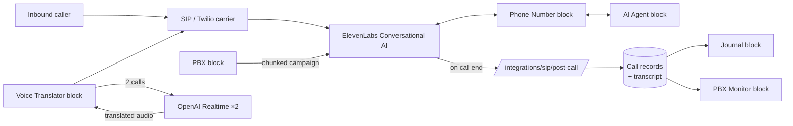

# Integrations

Breadth catalog: every block, every Worker SDK adapter, the telephony stack, MCP tools, and the real-time WebSocket data tier. Use this to evaluate range and depth of integration work.

For the architectural choices behind these, see [architecture.md](architecture.md). For the trade-offs, see [decisions.md](decisions.md).

---

## 1. Block catalog (45+ across 7 sections)

A block is the atomic unit on the canvas. Each has a type ID, a default config, a UI body, and edge wiring rules that auto-patch its config when connected to other blocks.

### Telephony — ElevenLabs (4)

| Block | Type ID | Capability |
|---|---|---|
| Phone Number | `ai.phone_number` | SIP trunk or Twilio — inbound & outbound voice |
| AI Agent | `ai.agent` | ElevenLabs conversational voice agent (prompt, voice, model) |
| PBX | `ai.pbx` | Virtual PBX — campaign auto-dialer, parallel calls, operator routing |
| Journal | `ai.journal` | Standalone call history viewer — transcripts, audio, CSV export |

### Telephony — Custom Voice (5, all PRO)

| Block | Type ID | Capability |
|---|---|---|
| Custom Agent | `voice.custom_agent` | Own STT/LLM/TTS pipeline (Deepgram + DeepSeek/OpenAI + Cartesia) |
| Call Guard | `ai.call_guard` | AI call monitor — voicemail / silence / rudeness detection |
| Voice Translator | `voice.translator` | Real-time bidirectional speech translation between two callers via OpenAI Realtime |
| SIP / ARI Trunk | `telephony.trunk` | Asterisk SIP trunk configuration |
| PBX (ARI) | `ais.pbx` | Virtual PBX dialing through Custom Agent + Asterisk |

### AI Agents (5)

| Block | Type ID | Provider |
|---|---|---|
| ChatGPT | `ai.llm_agent` | OpenAI GPT models |
| Claude Agent | `ai.claude_agent` | Anthropic Claude — vision, reasoning, automation |
| Grok Agent | `ai.grok_agent` | xAI Grok — X/Twitter data |
| DeepSeek | `ai.deepseek_agent` | DeepSeek V3 + R1 reasoning |
| Groq | `ai.groq_agent` | Groq — ultra-fast Llama, Mixtral, Gemma inference |

All AI Agent blocks share a hub-style config: they accept connections from messengers, external-data adapters, files, and more, exposing those capabilities as tools to the underlying LLM.

### Automation (3)

| Block | Type ID | Use |
|---|---|---|
| Worker | `code.worker` | Python — runs in browser sandbox or on the server |
| Scheduler | `automation.scheduler` | Trigger connected blocks on an interval (cron-style) |
| Logic Gate | `automation.logic_gate` | Conditional routing — IF/THEN/ELSE for events |

### Messengers (7)

| Block | Type ID | Subgroup |
|---|---|---|
| Telegram | `messenger.telegram` | Telegram (Bot API) |
| Telegram Bot (AI) | `ai.telegram_bot` | Telegram (LLM-powered responder) |
| Telegram Channel | `messenger.telegram_channel` | Telegram (auto-publishing) |
| Telegram Reader | `messenger.telegram_reader` | Telegram (Telethon — user account) |
| Discord | `messenger.discord` | Discord |
| WhatsApp | `messenger.whatsapp` | WhatsApp Business — Meta Cloud API |
| Matrix Messenger | `messenger.matrix` | Matrix (VoIP + chat) |

### Storage (1)

| Block | Type ID | Capability |
|---|---|---|
| File Explorer | `storage.file_explorer` | Sandboxed file manager — 100 MB per workspace |

### UI / Monitoring (3)

| Block | Type ID | Renders data from |
|---|---|---|
| Worker Monitor | `ui.monitor` | `ctx.monitor.render(...)` widgets |
| PBX Monitor | `ui.pbx_monitor` | PBX call journal + live calls |
| Matrix Monitor | `ui.matrix_monitor` | Matrix call/chat events |

---

## 2. Worker SDK — `ctx.*` adapters

The object injected into every Python worker. Each adapter requires the corresponding block to be connected via an edge — otherwise calling its methods raises `RuntimeError`. Every adapter follows a uniform `_ApiMixin` pattern, so adding a new integration is a small, well-bounded diff rather than a bespoke code path.

| Adapter | Methods | What it provides |
|---|---|---|
| `ctx.state` | 5 | Persistent KV store backed by Redis + Postgres snapshot |
| `ctx.log` | 5 | Batched info / warn / error / debug logs |
| `ctx.monitor` | 4 + builders | Stream widgets to a connected Monitor block |
| `ctx.http` | 3 | GET / POST / fetch through Cloud Run egress proxy |
| `ctx.telegram` | 3 | Send / read / chat info via Telegram Bot |
| `ctx.files` | 4 | Read / write / list / delete in sandboxed FS |
| `ctx.llm` | `.ask` + `.claude` / `.grok` / `.deepseek` / `.groq` + `.ask_with_tools` | Multi-provider LLM routing — pick by name |
| `ctx.connected_blocks` | (read-only) | Map showing which blocks are wired to this worker |

Beyond these, the same `_ApiMixin` pattern backs a family of **real-time external-data adapters** — long-lived WebSocket connections to third-party APIs and data sources, exposed to worker code with the same uniform method shape (see the WebSocket data tier below).

### Multi-LLM routing

```python
def tick(ctx):
    # Use the first connected LLM block
    answer = ctx.llm.ask("Summarize today's support tickets.", system="You are a helpful analyst.")

    # Force a specific provider when multiple are connected
    fast = ctx.llm.groq("Classify this text: ...")            # Groq — sub-second
    deep = ctx.llm.claude("Draft a 5-step onboarding plan")   # Claude — reasoning
    cheap = ctx.llm.deepseek("Translate to Russian")          # DeepSeek — cost
```

This lets a worker stitch together "fast classifier → deep reasoner → cheap translator" without thinking about API keys, billing, or vendor SDKs.

### WebSocket data tier — sub-millisecond live data

In Server execution mode, the runtime opens long-lived WebSocket connections to supported external data sources and third-party APIs. Cached reads return from in-memory state in **0 ms** instead of 80–250 ms via REST, with no rate-limit ceiling. A worker simply calls the adapter method; the runtime decides whether to serve from the live cache or fall back to REST.

- **Push, not poll.** The runtime subscribes once and keeps the latest snapshot warm in memory; worker reads never touch the network.
- **No rate-limit ceiling.** Because cached reads don't hit the upstream API, a busy worker can read state every tick without burning a request quota.
- **Automatic REST fallback** in Browser execution mode, where no persistent WS connection is available.

This same caching pathway is reused across every real-time external-data adapter — a single mechanism rather than a per-source implementation.

---

## 3. MCP server — 13 tools

A FastMCP server at `https://api.nodegraph.io/mcp-api/mcp` lets any MCP-compatible AI (Claude Desktop, Cursor, ChatGPT) read and modify a user's workspaces. Authenticated via the same JWT as the REST API. Stateless (`stateless_http=True`).

| Category | Tool | What it does |
|---|---|---|
| **Read** | `get_workspace_graph` | Full graph JSON for a workspace |
| | `get_node_config` | Per-node config |
| | `list_block_types` | All available block types with their default configs |
| | `get_worker_logs` | Recent logs for a worker |
| | `get_call_history` | Call journal for a workspace / node |
| **Mutate graph** | `add_node` | Add a block of a given type at coords |
| | `remove_node` | Remove a block (and its edges) |
| | `connect_nodes` | Draw an edge — auto-patches edge wiring |
| | `disconnect_nodes` | Remove an edge — undoes wiring |
| | `rename_node` | Rename a block |
| | `update_node_config` | Patch a block's config |
| **Operations** | `restart_worker` | Stop & start a worker |
| | `start_dialer` | Launch a PBX campaign |

All graph mutations go through a single `_modify_graph()` helper that:

1. Reads the latest graph row inside a transaction
2. Applies the change
3. Increments `version`
4. Writes back

This keeps the AI assistant's mutations on the same optimistic-locking pathway as a human user clicking buttons in the canvas — there's no separate code path with weaker invariants.

---

## 4. Telephony stack



### What's interesting under the hood

- **Adopt existing ElevenLabs agents.** `POST /agents/adopt` pulls full configuration (voice, prompt, tools, model, voice settings, temperature, max_tokens, platform tools, safety rules, raw config) into a local NodeGraph record without creating a new agent on ElevenLabs side. Lets users bring already-configured agents onto the canvas non-destructively.

- **Chunked campaign dialer.** A large campaign is split into chunks sized to the user's chosen concurrency. Each chunk submits a batch and waits for it to complete before the next one starts. Pause / resume / stop is implemented via Redis flags polled at chunk boundaries; the campaign state survives container restarts. After completion, a short wait + retry pass resolves all conversations (transcripts, summaries) before marking the campaign done.

- **Auto-resolve stale campaigns.** When the journal is opened, the backend scans for `batch_running` / `completing` runs whose ElevenLabs batch is actually finished. It resolves one per request (limit to avoid pool exhaustion) and busts the journal cache.

- **Voice Translator.** Bridges two phone lines via PSTN audio streams. Each side runs its own real-time speech-to-speech session. Audio from caller A → ASR → MT (with a shared glossary of proper nouns and technical terms) → TTS → caller B's audio output, and vice versa. The state machine handles connection drops, disagreement on hangup, and end-of-utterance detection.

- **Post-call webhooks.** `ai.postcall_webhook` block receives the full ElevenLabs payload (transcript, summary, tool calls, evaluation criteria) and forwards it to the user's destination URL.

---

## 5. AI integrations

Beyond the LLM agent blocks, AI is woven through the platform:

| Integration | Where | What |
|---|---|---|
| **Jarvis** | Inside the app | Built-in AI assistant that uses the same `ai_tools` registry as MCP |
| **MCP server** | `/mcp-api/mcp` | 13 tools — see above |
| **Worker auto-heal** | `worker-runtime` | When a worker errors out 5 ticks in a row, optionally calls Claude with the error + code, applies the fix, restarts |
| **AI Agent blocks** | LLM blocks | Worker code can call them as tools via `ctx.llm.*` |
| **ElevenLabs Conversational AI** | Telephony | Real-time voice agents over phone |
| **OpenAI Realtime** | Voice Translator | Bidirectional speech translation |
| **Custom Voice pipeline** | `voice.custom_agent` | Deepgram (STT) + DeepSeek/OpenAI (LLM) + Cartesia (TTS) — own STT/LLM/TTS chain over Asterisk SIP/ARI |
| **AI-assisted code writing** | Worker block | Inline "ask AI to write this" while editing worker code |

---

## 6. Frontend integrations

Everything user-facing reflects the same edge-as-config model. A short list:

- **Audio playback** in the Journal block uses an HTML5 `<audio>` element with token-in-URL — no extra API for the player. Frontend tracks `activeSessionId` so opening a second audio kills the first.
- **CSV export** runs entirely in the browser — no server round-trip for exporting a 5 000-call campaign.
- **Worker code editor** is a custom Flutter widget with syntax-highlighting; deploy + start are JWT-authenticated calls to `core-api`.
- **Live monitor** widgets are rendered from a JSON list pushed via WebSocket — `metric`, `status`, `table`, `text`, `progress`, `list`, `log`, `separator`. The renderer is dumb on purpose; all logic lives in the worker.
- **Block inspector** dialogs are generated from a declarative schema (`BlockConfigField[]`) — adding a new config field to a block doesn't require new UI code.

---

## 7. How a new block is added

Every block on the canvas is registered through a single declarative API. A new integration — say, a new messenger, a new data source, or a private vendor block for a specific client — is a small, well-bounded diff against the platform, not a fork.

The five pieces (most blocks need only the first two):

```dart
// 1. Declarative definition — type ID, config defaults, plan, layout
BlockDefinition(
  type: 'messenger.acmechat',
  title: 'AcmeChat',
  section: 'Messengers',
  subgroup: 'AcmeChat',
  minPlan: 'pro',
  serverOnly: true,
  defaultCfg: const {
    'acmechat_key_id': null,
    'default_channel': 'general',
    'llm_node_id': '',
  },
  buildBody: (_, bc) => AcmeChatBlockBody(bc: bc),      // 2. UI
  buildInspector: AcmeChatInspector.build,              // 3. (optional) inspector schema
)

// 4. Edge wiring rules — auto-patch cfg when edges are drawn
EdgeWiringRule('code.worker',  'messenger_node_ids', 'messenger.acmechat'),
EdgeWiringRule('ai.llm_agent', 'messenger_node_id',  'messenger.acmechat'),

// 5. (Server-mode) ctx adapter — exposes the API inside worker code
class AcmeChatAdapter(_ApiMixin):
    def get_messages(self, channel: str = "general") -> dict: ...
    def send_message(self, channel: str, text: str): ...
```

That's the entire surface. **The catalog page, the inspector dialog, the edge auto-wiring, the SDK exposure to worker code** — all generated from these declarations. No per-block dialog widget, no per-block routing, no per-pair edge-handling code.

This is the single most important architectural decision for the breadth catalog above. It's also the reason custom blocks for specific clients are realistic — the platform absorbs them as plugins. See [decisions.md → "A declarative block platform"](decisions.md#13-a-declarative-block-platform-not-a-hard-coded-set) for the trade-offs accepted to keep this generative API clean.

---

## What this catalog implies for the engineering work

- **45 blocks** averaging ~700 lines of UI code each — the largest single file is the Journal block at ~2 000 lines covering CSV export, audio player, campaign grouping, filters.
- **The telephony router** is ~3 350 lines of cohesive code: calls, journal, dialer, runs, batch resolve, audio bridging — kept together because they share a transaction model and a cache-invalidation strategy.
- **The Worker SDK** is ~2 400 lines: a family of `_ApiMixin` adapters + sandbox bootstrap + log batcher.
- **The MCP server** is ~600 lines: 13 tools, each one a thin wrapper over the corresponding REST endpoint to keep behaviour in lock-step.

The breadth above is real because there's a small set of tight conventions (edge wiring rules, a single API mixin shared by every adapter, shared schemas, a single graph-mutation helper). New integrations slot in by following them, not by spawning bespoke code paths.
